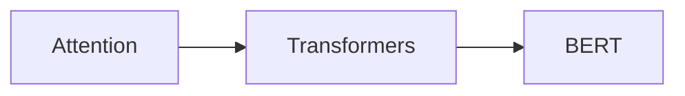

# Technical-Project-1-NLP

## Key Concepts of BERT 

- It is very huge and expensive to train so, it compensates for that by leveraging Transfer Learning

- The way to understand BERT is to go as :

- Let's try to skip them for now and move on :p, we will come back if needed 

- The flow that for now we are gonna follow is something like 

